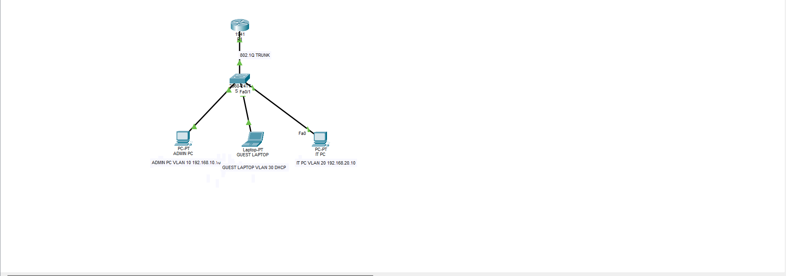
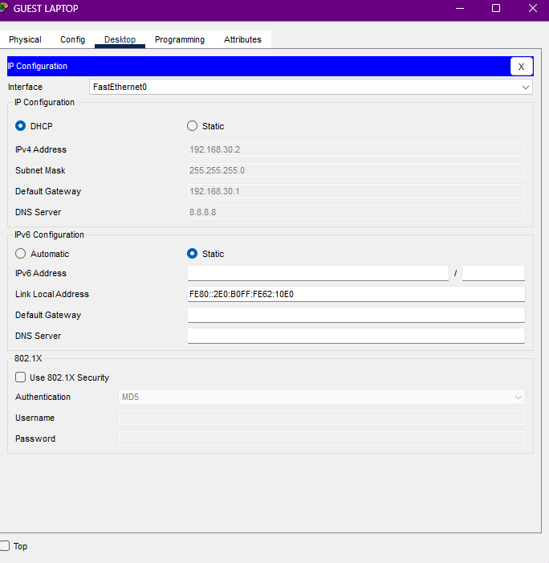
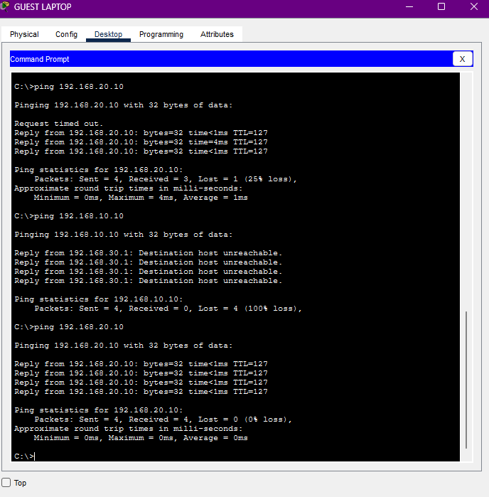
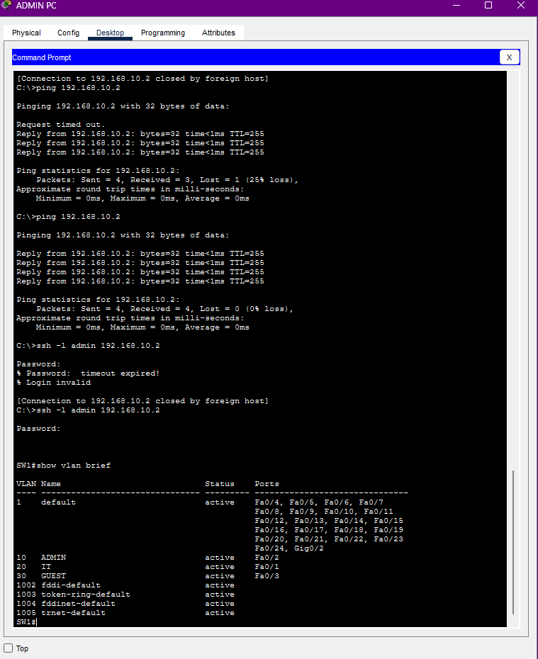
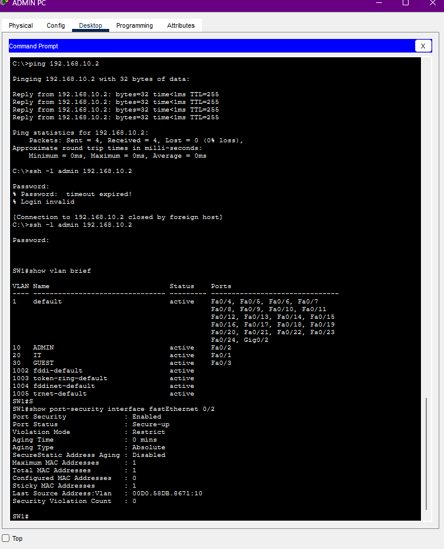

Secure Small Business Network - Cisco Packet Tracer

This is a small network lab I made while learning networking and cybersecurity in Cisco Packet Tracer.

I wanted to practice VLANs, routing, DHCP, ACLs, SSH, and port security in one project without making the network too complicated.

Topology

Network setup:

- VLAN 10 - ADMIN - 192.168.10.0/24
- VLAN 20 - IT - 192.168.20.0/24
- VLAN 30 - GUEST - 192.168.30.0/24
- Router and switch connected with an 802.1Q trunk
- Router-on-a-stick used for inter-VLAN routing

Devices:

- ADMIN PC: 192.168.10.10
- IT PC: 192.168.20.10
- GUEST Laptop: DHCP
- SW1 management IP: 192.168.10.2

DHCP

The guest laptop gets its IP automatically from the router.

ACL

I created an ACL to block the GUEST VLAN from reaching the ADMIN VLAN.

GUEST -> ADMIN = blocked
GUEST -> IT = allowed

SSH

I configured SSH on the switch so it can be managed remotely from the ADMIN PC.

Port Security

I enabled port security on the ADMIN PC switch port.

- Maximum MAC addresses: 1
- Sticky MAC enabled
- Violation mode: restrict

What I learned

The biggest part of this project was troubleshooting.

I had problems with VLAN ports, the switch management IP, and some commands in the CLI. I used commands like:

show vlan brief
show interfaces trunk
show ip interface brief
show port-security interface fastEthernet 0/2

That helped me understand what was actually happening instead of only copying commands.

Project file

secure-small-business-network.pkt

Built with Cisco Packet Tracer.
